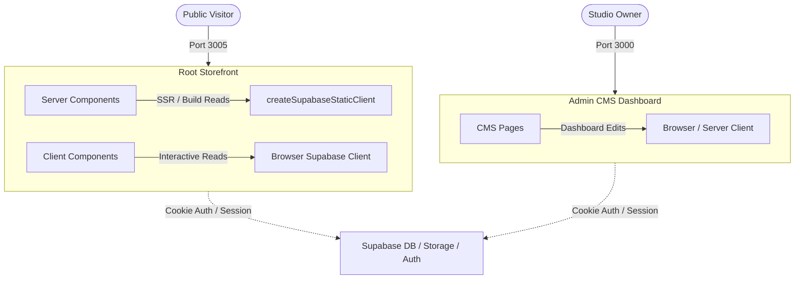

# Photographer Studio UI & CMS

[](https://nextjs.org)
[](https://react.dev)
[](https://tailwindcss.com)
[](https://supabase.com)
[](#license)

A premium, fully localized photographer portfolio studio website built with Next.js 15 (App Router) and React 19, powered by Supabase, and styled with Tailwind CSS v4 and shadcn/ui. The repository features two decoupled applications: the public-facing storefront and an independent custom CMS admin dashboard under `/cms`.

---

## Table of Contents

- [About](#about)
- [Features](#features)
- [Tech Stack](#tech-stack)
- [Architecture](#architecture)
- [Project Structure](#project-structure)
- [Getting Started](#getting-started)
- [Configuration](#configuration)
- [Security](#security)
- [How to Contribute?](#how-to-contribute)
- [What's Next?](#whats-next)
- [License](#license)
- [Acknowledgements](#acknowledgements)
- [Author](#author)

---

## About

This repository serves as a complete digital solution for a professional photography studio. It is architected around two decoupled Next.js 15 apps:
1. **Public Site (Root)**: High-performance, SEO-friendly, and multilingual website displaying galleries, service packages, pricing structures, testimonials, and dynamic contact pages.
2. **Admin CMS (`/cms`)**: A separate administration portal enabling photographers to manage dynamic data, update image assets, review inquiries, and tweak localization content in real time.

Both projects are engineered with TypeScript and modern React 19 paradigms, utilizing Supabase for persistent storage, authentication, and secure client/server data fetching.

---

## Features

### 🌐 Multilingual & Localized Routing (Root App)
- Fully dynamic routing matching locale patterns (currently supporting English `en` and Spanish `es`).
- Locale validation and automatic redirects from `/` to the user's appropriate language route.
- Robust localization mapping supporting fallback mechanisms for content rendering.

### ⚡ Premium UI & Rich Aesthetics
- Custom-tailored typography combining Montserrat, Playfair Display, and Geist Mono.
- Fully responsive design using modern layouts with subtle hover transitions and animations.
- Beautiful, high-performance **Infinite Carousel** for visual media display.

### 🏗️ Data Architecture & Performance
- Optimized for speed using Next.js **ISR (Incremental Static Regeneration)** with a validation window of `revalidate = 60` for dynamic catalog caching.
- Dynamic static params rendering via Supabase DB queries (`generateStaticParams`).

### 🛠️ Dedicated Admin CMS (`cms/`)
- Entirely separate codebase and dependency scope (`node_modules`), ensuring zero pollution of production bundle weights for public visitors.
- Rich editing interfaces to update client galleries, contact requests, and localization strings.

---

## Tech Stack

| Domain | Technologies |
|---|---|
| **Core & Framework** | [Next.js 15 (App Router)](https://nextjs.org), [React 19](https://react.dev), [TypeScript](https://www.typescriptlang.org) |
| **Styling** | [Tailwind CSS v4](https://tailwindcss.com), [@tailwindcss/postcss](https://github.com/tailwindlabs/tailwindcss-postcss), [shadcn/ui](https://ui.shadcn.com), [Radix UI](https://www.radix-ui.com) |
| **Backend & Services** | [Supabase Database](https://supabase.com), [@supabase/ssr](https://supabase.com/docs/guides/auth/server-side/nextjs), [Supabase JS Client](https://supabase.com/docs/reference/javascript/introduction) |
| **Fonts** | Montserrat, Playfair Display, Geist Mono |
| **Package Manager** | [pnpm](https://pnpm.io) |

---

## Architecture

This project splits front-of-house (Root portfolio) and back-of-house (CMS dashboard) duties into decoupled Next.js projects. They do not share a `pnpm` workspace, keeping dependencies lightweight and deployment surfaces isolated.



### Data Fetching Flow
- **Build Time**: `createSupabaseStaticClient` fetches language configurations and static pages during next build to generate static paths.
- **Request Time**: Server components use `createSupabaseServerClient` with cookie resolution for authenticated sessions and real-time state tracking.
- **Client Side**: Standard client components interact through a unified browser client (`src/lib/supabase/client.ts`).

---

## Project Structure

```text
photographer-ui/
├── .agents/                 # Workspace customization rules & best practices
├── cms/                     # Separate Admin CMS Dashboard Next.js app
│   ├── src/                 # CMS application code
│   ├── package.json         # CMS-specific dependencies
│   └── tsconfig.json        # CMS TypeScript configuration
├── public/                  # Public asset files for Root app
├── src/                     # Public Storefront code
│   ├── app/                 # App Router folder structure
│   │   ├── [locale]/        # Localized pages (en, es)
│   │   │   ├── about/       # Storefront About Page
│   │   │   ├── contact/     # Storefront Contact Page
│   │   │   ├── services/    # Storefront Services Page
│   │   │   └── page.tsx     # Localized Homepage
│   │   ├── error.tsx        # Global error boundary (Spanish fallback)
│   │   ├── layout.tsx       # Core html structure & Font bindings
│   │   └── page.tsx         # Redirect controller (resolves locale)
│   ├── components/          # Reusable react component ecosystem
│   │   ├── common/          # Layout blocks (Header, Footer, Widgets)
│   │   ├── home/            # Homepage sectional views (Hero, Pricing, Gallery)
│   │   └── ui/              # Primitive shadcn/ui components (radix wrappers)
│   ├── lib/                 # Shared utilities, tailwind helper, and Supabase hooks
│   ├── styles/              # Global styles importing Tailwind v4 variables
│   └── types/               # Globally registered typescript declarations
├── package.json             # Root-level dependencies
└── tsconfig.json            # Root TypeScript configuration
```

---

## Getting Started

Because the storefront and the CMS are isolated apps, they require independent initialization. 

### Prerequisites
Make sure you have Node.js installed, along with the `pnpm` package manager:
```bash
npm install -g pnpm
```

### 1. Root Application (Public Portfolio)
To install dependencies and start the development server for the storefront:
```bash
# Install root dependencies
pnpm install

# Start Turbopack dev server on port 3005
pnpm start
```
The site will be running at [http://localhost:3005](http://localhost:3005).

### 2. CMS Application (Admin Dashboard)
To install dependencies and start the development server for the admin CMS:
```bash
# Navigate to cms folder
cd cms

# Install CMS dependencies
pnpm install

# Start development server on port 3000
pnpm dev
```
The CMS will be running at [http://localhost:3000](http://localhost:3000).

---

## Configuration

Both applications require a `.env.local` file at their respective directory roots to establish connections with your Supabase project backend. Next.js loads these files automatically.

Create a `.env.local` file at the repository root (and another inside `cms/` if needed):

| Key | Mandatory | Description |
|---|---|---|
| `NEXT_PUBLIC_SUPABASE_URL` | Yes | The endpoint URL of your Supabase project. Must be prefixed to be visible to the browser. |
| `NEXT_PUBLIC_SUPABASE_PUBLISHABLE_KEY` | Yes | The anonymous API key generated by Supabase for safe client-side reads. |

Example `.env.local`:
```env
NEXT_PUBLIC_SUPABASE_URL=https://your-project-id.supabase.co
NEXT_PUBLIC_SUPABASE_PUBLISHABLE_KEY=eyJhbGciOiJIUzI1NiIsInR5cCI6IkpXVCJ9...
```

---

## Security

This project implements the following layers of security:
- **Server-Side Rendering Auth**: Session tokens are passed securely via Next.js cookies via `@supabase/ssr`.
- **Database Row Level Security (RLS)**: Public tables (`languages`, `galleries`, `services`) are set to allow anonymous read requests only. Mutative actions (inserts, updates, deletes) are restricted to authenticated roles (managed by Supabase Auth).
- **Environment Isolation**: Private service role keys are excluded from frontend environments to prevent leakage in client bundles.

---

## How to Contribute?

We welcome developers to submit issues, bug fixes, or enhancements. Please adhere to the following workflow:

1. Fork this repository.
2. Create your branch for changes: `git checkout -b feature/amazing-feature`.
3. Stage and commit your code.
4. Push your branch: `git push origin feature/amazing-feature`.
5. Open a Pull Request detailing your changes.

### Linting & Formatting Rules
Before committing your work, verify that your changes adhere to code style guidelines:
```bash
# Run ESLint validation
pnpm lint

# Automatically resolve style issues
pnpm lint:fix
```

*Note: Unused variables are intentionally ignored in eslint configuration to streamline prototyping.*

---

## What's Next?

Future updates and roadmap items planned for the photography studio stack:
- [ ] **Image Automation**: Automate web-ready format encoding (WebP/AVIF) and blur placeholders during Supabase uploads.
- [ ] **Booking Engine**: Add an interactive scheduling system supporting deposit payments.
- [ ] **CRM Inboxes**: Direct inquiry forms to an admin-readable inbox inside the CMS.
- [ ] **SEO Optimization**: Enhanced structured metadata tags tailored per gallery view.

---

## License

This project is proprietary and private. All rights reserved. Reproduction, distribution, or unauthorized use of the source code is strictly prohibited.

---

## Acknowledgements

Special thanks to the open-source projects making this design possible:
- [Next.js](https://nextjs.org) for the App Router architecture.
- [Supabase](https://supabase.com) for backend capabilities.
- [shadcn/ui](https://ui.shadcn.com) and [Radix UI](https://www.radix-ui.com) for visual and accessible primitives.
- [lucide-react](https://lucide.dev) for interface iconography.

---

## Author

Managed and developed by the studio engineering team. For any collaboration proposals or questions, feel free to reach out to the project administrator.
